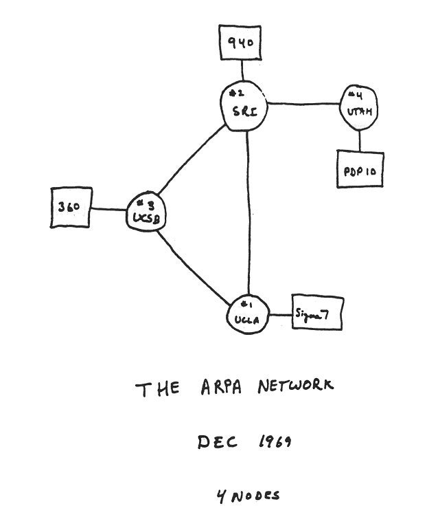
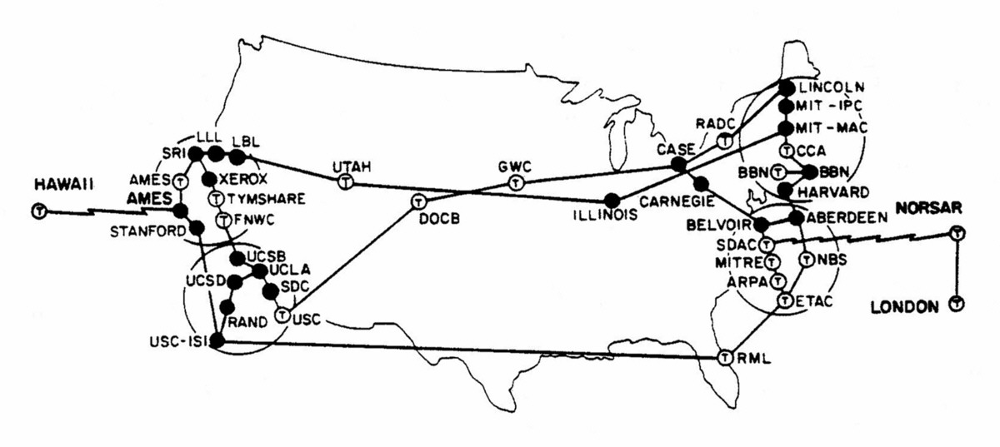
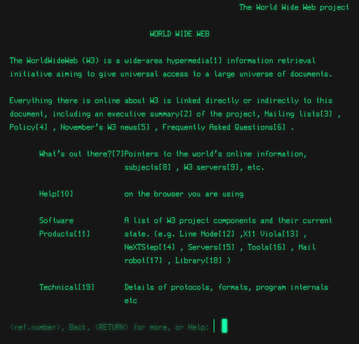
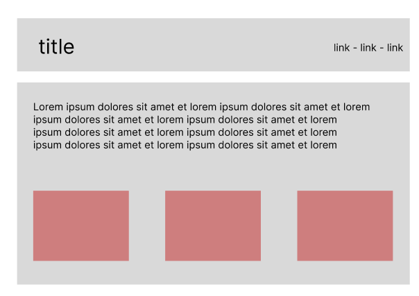

# Augmenting the human

Welcome!

<!-- This class is going to take a look at some of the original visions of the people who worked on some of the first digital technologies. Starting from there, we will trace the history of information technologies until today.

What did they envision as they were just scratching the surface of what computers could do? How does this vision carry today? Can we, and should we try to change the direction in which these technologies are going?

The second part of the class will be a review of HTML and introducing additional CSS concepts. -->

---

Housekeeping

Readings presentations:

- Session 3 - Maya
- Session 4 - Lucy
- Session 6 - Hong
- Session 10 - Reade

[Transmediale](https://transmediale.de/) / [CTM](https://ctm-festival.de/) / [Berlinale](https://www.berlinale.de)

---

Plan for the day

- dreams of computers
- dreams of networks
- html review
- css styles

---

## Dreams of computers

---

how would you qualify (y)our relationship with computers today?

---

when was the last time you used a computer to think deeply about a problem?

what are some future developments you're excited about? what about developments you're suspicious of?

---

J.C.R Licklider, _Man-Computer Symbiosis_, 1960.

<!--

J.C.R. Licklider was the director of DARPA, the research and development branch of the U.S. military. At the time, he was overseeing the ARPANet, which would eventually become the Internet ([The Computer as a Communication Device](https://www.kurzweilai.net/the-computer-as-a-communication-device)). Licklider selected and directed most of the people who worked on the ARPAnet, the precursor to the internet. Working on psychoacoustics, he realized that most of his time was taken up by monotonous, repetitive tasks, which could be automated by a computer. In this piece of writing, he anticipates that the computer will be of great use to humans, by getting rid of the annoying and superfluous tasks.

_What_ is an annoying and superfluous task remains debated, though. Talking about augmenting human capabilities, it's important to remember that computers can be—as Licklider wrote— a means to save us time from the mechanical tasks that take up most of our attention. The following question, then, is **what do we do with the time we've gained?**.

For example, searching through datasets in a library can result in more time dedicated to actual thinking about how those resources relate to us. Automatic formatting on a word processor allows us to take more time to think about the content.

In the end, taking care of formal details actually helps us narrow down what it is that we're doing, and even asking *why* we're going it.

To do that, he says computers would need to have better speed, better storage, better input, and better language.

Due to Moore's law, which observes that computers double in speed and storage every two years (see the graph [here](https://spectrum.ieee.org/transistor-production-has-reached-astronomical-scales)), storage and speed are no longer a problem.

With our contemporary screens, keyboards, mouses and interfaces, input systems are no longer a problem.

Still, remains the problem of the language, of _expressing what we want_ the computer to do.

This particular reading is interesting in how he lists out the practical obstacles of reaching such a collaboration (speed, language, and Input/Output). Out of those three obstacles, two of them have been overcome a long time ago. It's only the language part that is the problem. So now that we are close to having gotten rid of big technical hurdles, what are the non-technical hurdles left?

-->

---

David Rokeby, _The Computer as a prosthetic organ for philosophy_, 2003.

<!-- 

David Rokeby is a digital artist, known for [very nervous system](https://www.youtube.com/watch?v=SrawKucSSRw), one of the first interactive computer installations.

His argument is that using a computer to do non-computer things (sensing a human dancing, for instance) forces us to really think about what is this thing that we are trying to represent.

-->

---

how do you get a computer to give you the meaningful images of your life?

<!-- Turns out, it might seem a bit tricky at first, but one might be able to get close! -->

---

### Epistemic actions

---

they can help us access answers to known problems, by doing __mechanical__ tasks (finding, filtering, sorting, indexing).

<!--

Licklider approaches the problem in terms of **cooperation**: what is it that we want to do? Do we want to solve math formulas, to pick a movie to watch, to invest money in different funds or to learn about a particular topic?

In order to answer these questions, he compares the strengths of humans and the strengths of machines and extrapolates on how they could work together. This *working together*, this collaboration, implies that the answer to the problem is not yet known. There is no clear information that needs to be delivered, but rather information that needs to be pieced together in order for the investigator (i.e. the learner) to create their own knowledge. Such an approach is in line with a pedagogical theory called **constructivism**, which we will talk more about in the week about and education.

-->

---

computers can help us formulate problems and _construct_ answers by organizing and presenting information.


---

they did not answer the questions of __intent__ (what do I want to do) and __purpose__ (how do I want to do it).

---

to access the capabilities of the computer, we first need to __translate__ the world into computer terms!

this involves __standardization__ and __disambiguation__.

<!--

Standardization is a form of abstraction: you only keep the parts of something that fits the standard. The rest is discarded.

So in order to make the computer work with something that matters to us (generally, things we want to remember), then we first need to remove some parts that might be meaningful, and then we need to represent this data such that sense can be made from it when we (re-)access it via the computer.

In the beginning of computing, it was pretty easy: mathematics mean what they are. We're less sure about the creation of meaning than about the way differential equations work, so in a lot of computer-aided applications, the problem is still to formulate exactly what the problem is. But then problems got a different kind of complex. "I would like to see all that is relevant to the current task at hand" is too vague of a query for a computer to fulfill, and is a field that is still currently being worked on, particularly in the realm of personal assistants (e.g. Siri, Alexa, etc.). It's therefore still the task of the designer and developer to try to anticipate, accomodate, and encourage anything that their user might think about or attempt to do.

-->

---

data > information > meaning

the __presentation__ of information contributes to meaning

---

Ivan Sutherland, the next director of DARPA was thinking about _The Ultimate Display_

- the first touchscreen, [`SKETCHPAD`](https://www.youtube.com/watch?v=6orsmFndx_o)
- the first virtual reality headset, [`SWORD OF DAMOCLES`](https://www.youtube.com/watch?v=eVUgfUvP4uk)

<!--

One of the people Licklider influenced was on Doug Engelbart, a Stanford researcher who founded the *Augmented Research Center*, particularly well known for presenting [the mother of all demos](https://en.wikipedia.org/wiki/The_Mother_of_All_Demos) ([video](https://www.youtube.com/watch?v=JQ8ZiT1sn88)). Engelbart was also influenced by another thinker, Vanevar Bush, who wrote [As We May Think](https://www.theatlantic.com/magazine/archive/1945/07/as-we-may-think/303881/).

-->

---

displays adds spatiality as a way to __reveal__ information (making visible an object), and to __lay it out__  (making visible the relationship of objects) and to __manipulate it__ (changing it in real-time to observe its behaviour).

---


<!-- 

While Sutherland is focused on the wonderland of mathematics, it is interesting to see how he considers the display: not just as a means to show information, but also as a means to **manipulate** it. By using computer processing power, we don't need to type in every single command as written text, it should be possible to imagine a system in which the interaction is as *intuitive* as possible, while interacting with objects that are not, at first, intuitive at all (e.g. the Catmull spline).

As visual appendices, displays are also means to expand the range of our interactions. While the first means of interaction was purely mechanically written (i.e. typographical), having a spatial display now allows us to organize information in a non-linear fashion. Similarly to how Sutherland talks about kinesthetic displays, we could potentially think of olfactive displays, or kinetic displays—essentially vibrating smartphones and game controllers.

Slightly tangentially, there is [some evidence](https://www.bbc.com/future/article/20190226-how-your-language-reflects-the-senses-you-use) that a "visual-first approach" is actually somewhat dependent on the fact that Western linguistic cultures are visual cultures, moreso than non-Western linguistic cultures which, such as Farsi or Cantonese, have a richer vocabulary when it comes to tasting things. Additionally, visual cues are not as good as olfactive cues (smells) when it comes to helping memory.

Displays allow us to:

- see-through matter: seeing two things at the same time

- involve all human senses
- - scent as an archive, like a journal/spotify
- - smell as mood: meditation app with different smells
- - ordering ingredients from the markets (smell and taste)
- - smell as accessibility: trash
- - smell as work mood

-->

---

__comparing__ and __relating__ are two ways to create knowledge.

computers make it possible to compare the invisible world with the visible world.

- [the preservation of favored traces](http://benfry.com/traces/), reveals the hidden evolution of a text through the comparison of the different editions.

- [growing regions](http://npl.wiki/view/welcome-visitors/view/growing-regions), compares the different approaches to the built environemtn, and their relationships.

---

## Dreams of networks

---

The internet is a bunch of computers connected by cables.



---



---

The Internet can carry a lot of different kinds of information

(like the telegraph carries single words, or the phone carries soundwaves)

---

### Web 1.0

---


The Web was developed at CERN in order to exchange _documents_, that were formatted in a language called _HTML_.

<!-- In the 1980s, Tim Berners-Lee came up with a way to exchange documents across the Internet. These documents became webpages, made up of _hypertext_, connected by _hyperlinks_ and viewed via web browsers.

The keyword is _hyper_:

- hypertext markup language (html)
- hypertext transfer protocol (http)
- hyperreference link

-->

---



<!-- 

That webpage was essentially describing itself.

-->

---


<!--

 the earliest and most popular of which was Netscape Navigator.

Netscape was a browser that allowed you to display images and _click_ on links, which made the web a lot more accessible for the broader audience. It also introduce the JavaScript language.

-->

---

### Web 2.0

---

The web 2.0 refers to when the WWW becomes a lot more usable

- lowering the barrier to entry
- interacting on with websites
- the _social_ web and the _mobile_ web

---

what is at stake:

- democratization vs. corporatization
- information vs. attention

---

## Structure and style

---

### HTML review

---

The _HyperText Markup Language_ describes what makes up a webpage.

(i.e. a document meant to be served over the web protocol via web browsers)

---

An HTML element is made up of:

- opening and closing tags
- contents
- attributes

```html
&lt;a href="https://webpage.com"&gt; click here &lt;/a&gt;
```

---

Examples of tags:

- __p__ for paragraph
- __h1__ for headings
- __a__ for links
- __img__ for images
- __ul__, __ol__ for lists
- __li__ for list items
- ...

---

### CSS basics

---

A CSS file contains all of the style rules to be applied to a document.

CSS makes [form separate from content](https://csszengarden.com).

---

A style rule targets elements and sets the value of attributes.

```css
element {
    attribute: value;
}
```

```css
a {
    color: red;
    font-size: 14px;
}
```

---

We need to tell the HTML which CSS rules to apply by __linking__ the CSS documents:

```html
&lt;link rel="stylesheet" href="style.css" /&gt;
```

---

### Layout

---

Layout is done by putting things in boxes and manipulating the size and the space between those boxes.

An HTML box is called a __div__.

We can manipulate __width__, __height__, __margin__, __padding__.

---

Introducing __flexbox__.

```css
container {
    display: flex; /* this line unlocks flexbox layout for the children of the container */
    flex-direction: row; /* this tells the children to align as a row (the default is column) */
}

```

([full guide here](https://css-tricks.com/snippets/css/a-guide-to-flexbox/))

---

### Exercise

---

On a separate page, make a header with a title on the left and some links on the right.

Inside the main part of the webpage, put some text, and then a row of three images.



---

### Media queries

---

Media queries is a system allowing you to __change the style depending on the screen size__.

```css
@media only screen and (min-width: 600px) {

/* here, we write any rule that will only be applied if our screen is BIGGER THAN 600PX */

}
```

<!--

This is very useful when you want to adapt things to a smartphone screen, for instance! This modular approach to webdesign is called "media queries".

One thing we often change is width of the main container (content on a phone usually takes the whole width, but not on laptops).

You can read about it more on [w3schools](https://www.w3schools.com/css/css_rwd_mediaqueries.asp).

-->

---
## Outro

---

The dreams of computers were dreams of helping us think, which requires an act of __translation__ (into machine languages) and __representation__ (via screen interfaces).

---

On a webpage, everything is a box. By using whitespace and flexbox on those boxes, we can do whatever layout we want!

__Homework__:

- Write your reading response on a new page on your website. Add some images, and use flexbox to lay them out nicely. Add some margin and padding to organize white space. Make sure the layout is responsive on mobile, using media-query (see how to view the mobile version on chrome)
