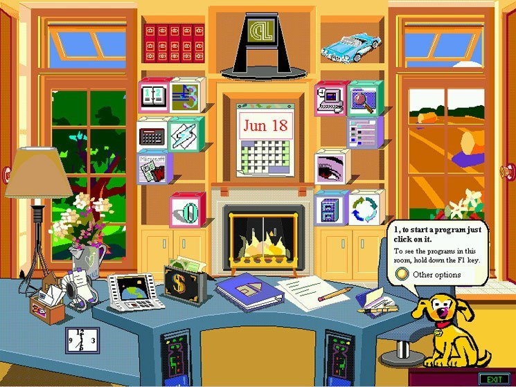
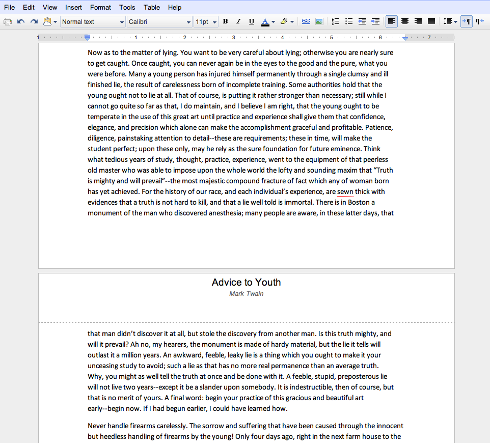

# Interaction Design

<!-- This week is going to focus on interaction as a medium. After looking at different kinds of media, and how some content works better than some other content through these media, we'll focus more closely on the specificities of interaction.

This will start from a high-level, conceptual perspective, and focusing all the way to the specifics of user interface design and user experience design (along with expliciting the difference between the two!). -->

Welcome!

---

## Intro

---

Housekeeping:

- Mandatory learner hours (book one meeting between today and spring break).
- Berlinale starts today! Tickets go on sale everyday at 10:00am (usually sell out within ten minutes)

---

Plan for the day:

- Reading presentation by Lucy
- designing interactions
- user interfaces and user experiences
- javascript part 2
- intro to react

---

- _A Cultural Approach to Interaction Design_, Janet Murray, MIT Press, 2011.
- _The Anti-Mac Interface_, Jakob Nielsen, Nielsen Group, 1996.
- _Magic Ink_, Brett Victor, 2013

---

## Designing interactions

---

a good interaction is an __exchange__ between two or more agents (possibly conscious agents), through which _something has been achieved_.

<!-- In [The Art of Interactive Design](https://nostarch.com/interactive.htm), Chris Crawford defines an interaction as a __conversation__, between multiple agents who, one after the other, "listen, think, and speak", which in computer terms, would consist of "input, process, output".

The richness of an interaction comes from the care in the listening experience ("is everything that is being said, being heard?" -think of non-verbal cues), to the depth in processing ("what is it that is really being meant, and how can I extract that meaning to serve as the basis for my response?") to the quality and clarity of the output ("is what I'm saying clearly reflecting the results of my thought process? does it leave room for further exchange?")

Whatever the response/output is, it's always important to *leave room for further action*. Even when an error happens, the handling of the error should be done "gracefully" (e.g. "This operation did not succeed. Would you like to try again? Or try a different operation?)

---
some of the requirements for interaction include:
- being able to communicate exactly what you intend,
- having an equal interest in both parties,
- having a common factor, common references,
- being able to receive information,

---

links -> recommendations or suggestions -->

---

The elements of an interaction are:

- a designer
- a system
- a _domain_
- a visitor

<!-- Most interactive systems include: the developer, the system and the user.

In terms of the __interactor__, it's a significant switch from user: user means passive, while interactor means active. Just because one is on the final, receiving end of an event (even if it's an interactive event), doesn't mean that they do not re-appropriate the event for themselves, and engage with it in non-expected ways. There is a thin line between making a system error-proof (making sure the interactor doesn't break the system by inputting the wrong data), and making the system fool-proof (making sure the interactor doesn't do anything too complicated because the assumption is that the interactor can't know as well as the designer).

The concept of __agency__ is tied to the second meaning: an interactive system should *enable* its interactor, allowing them to do as much as they would like to do, as much as they can imagine, and perhaps even more. A good example of such a thing is the LEGO brick. A system which provides agency is __a system which makes you responsible for what you want to be responsible for__. On the opposite, a system like an automatic slide door doesn't provide much agency: it's either fully open or fully closed, and doesn't exactly tell you what is need for either of these states to change.

The need for __transparency__ in interactive systems comes from this similar idea. Thinking that a system is intuitive relies on a particular number of __assumptions__: you already know shortcuts, design heuristics, patterns and processes. A transparent system, on the other side, is a system which exposes itself to the interactor, and only assumes that she would be able to make sense of it, given a good interface. Robert Henke's [CBM8032](http://www.roberthenke.de/concerts/cbm8032av.html) is a good example of the things someone can do if they're given access to all the *relevant* parts of a system.

Additionally, interfaces on desktop between Mac, Linux and Windows assume very different behaviours of their users by showing them different amounts of information -->

---

The computer is different in that it supports __highly dynamic__ interaction.

<!-- The computer can "think". That is, it can act and respond somewhat __dynamically__ and __contextually__. If the programmers can think through the possible future situations that the computer will be confronted with, it will give the impression that the interactor is having a "smart" conversation with the system.

In short, digital media is different from other media in that __it can reconfigure itself as it goes__. The problem, as we've seen with Licklider the previous week, is that thinking through possible problems in advance turns out to be more complicated than expected. So the answer at this point is either to establish the digital product you have as either close-ended or open-ended. Close-ended means that you are not providing anything beyond the basics of the product can do: the scope is tight, the interactions safe, and the "world" narrow. On the other side, open-ended means that you leave some room for interpretation to the interactor. It might not be as rigorous—in the scientific sense of the term—but it will provide a different kind of engagement, by involving the interactor deeper into the meaning of what she is presented with. Open-ended systems involve some kind of [gestalt](https://en.wikipedia.org/wiki/Gestalt_psychology#Figure-Ground_Organization) (the whole is greater than the sum of its parts).

The image above exposes a kind of open-ended system: Joseph Weizenbaum developed a program called [ELIZA](https://web.stanford.edu/class/linguist238/p36-weizenabaum.pdf), a chatbot which would essentially "bounce back" questions that the interactor would input. For instance, if you would type "I'm unhappy", ELIZA would respond "Why are you unhappy?". While the computer program has no idea of what "unhappiness" is, the interaction still elicits interesting thoughts in the interactor's mind. -->

---

Dimensions of digital media

- spatial
- procedural
- encyclopedic
- participatory

<!-- This description was first developed in [hamlet on the holodeck](https://mitpress.mit.edu/books/hamlet-holodeck) by Janet Murray

The __spatial__ component comes from this possibility of navigation, of going from one *place* to another. There are locations (websites), pathways (hyperlinks), landmarks (icons) which allow us to both __explore__ and __keep track of where we are__. How do we make sure that the interactor never feels lost?

The __procedural__ component relies on the fact that we are dealing specifically with __digital__ media. Through a computer, it becomes possible to set up rules, procedures, in order to allow for everything else (space, encyclopedia, participation).

The __encyclopedic__ component is the consequence of working with networked media. If one is connected to the Internet, there is no pre-existing reason as to why one shouldn't be able to access any information that is on the Internet. A good example of that is Assassin's Creed's [Discovery Mode](https://www.standard.co.uk/stayingin/tech-gaming/assassins-creed-origins-discovery-tour-shows-how-video-games-could-be-an-education-gamechanger-a3663966.html) through which you walk around the game world and learn of the "real world" equivalent of what you're seeing.

-->

---

interactive digital media can create __explorations__ of whole __worlds__, allowing for the __co-construction__ of meaning.

the interface is the gateway to access these worlds.

<!-- 

So, as we start developing interactive experiences within the context of museums, it's important to keep in mind those things:

- How are you enabling an interesting conversation? How responsive and predictive is your system. For instance, if the visitor takes one action (view an object up close), then would be the next action (e.g. viewing other objects? viewing advanced information related to the same object?)
- What kind of world are you creating? What are its multiple components, and where do you put the emphasis? Is it a social world, an economic world, a world connected to other worlds, etc.?
- How is meaning co-constructed? How do you let the visitor explore them in more details, at their own pace, in their own way? And to what extent do you ensure that all visitors get the same amount of knowledge, and each visitor gets their own version?

 -->

---

## User Interactions and Experienes

---

what is the difference between user interface (UI) and user experience (UX) ?

<!--

-> interface: appearance, information, functionality (number of buttons, the number of clicks, shortcuts, etc.)

-> experience: atmosphere and feeling (color, fonts, animations, sounds)

User Experience is comprised of *touch points*, of particular moments in which the public comes into contact with the product. For instance, the moment that someone books a ticket online for a museum, the moment someone enters the museum and goes through security check, the moment someone asks for directions at the information kiosk, etc. And how all of these come together in a coherent moment.

On the other side, User Interface is the collection of specific graphical elements which help create a *metaphor* for the interactor to understand how to manipulate and communicate with such a system.

In other words, UI is what we see, and UX is how we feel when we use something (the overarching ceremonial), and how we feel when we're done using it.

-->

---

UI design makes our product/artefact/app _usable_, with the lowest cognitive friction, and the highest reliable output.

They use __metaphors__ to communicate what it does.

<!-- User interfaces are indeed a metaphor, either building on previous knowledge by the interactors (e.g the Trash on a desktop isn't really a trash, but it does the same thing as a trash does), or by developing new habits (the [hamburger icon](https://blog.placeit.net/history-of-the-hamburger-icon/) ).

The point of a good UI is to have itself be forgotten. It should be as invisible as possible, while at the same time being "obvious". This pinnacle of obviousness was reached in Apple products, particularly with the iPod and the iPhone, which *didn't come with a user manual!* -->

---



Metaphors rely on __remediation__, the process of using old references to introduce new things.

<!--
    A newer medium also develops on top of previous media, in a phenomenon called __remediation__ (writing integrates parts of speech, photography integrate parts of drawing, cinema integrates parts of photography, etc.)
-->

---



<!-- Google Docs started with a page layout in order to get the users to understand that this is a familiar product. Once they are familiar with it, then the pages can be abandoned, since there are no _fundamental reasons_ for having pages on the web (i.e. there's no paper!) -->

---


---

No interface is "natural".

([some are quite weird](https://www.designernews.co/stories/84443-redditors-design-worst-volume-sliders-possible))

---


---

Good UI is made up of:

- __graphical elements__ (indicating hierarchy and purpose of each element)
- __input methods__ (typing, drag and drop, clicking, light sensor, camera, microphone, swipes/multi touch, heat sensor, motion)
- __system-related messages__ (success messages, error messages, etc.)

<!--

UI elements can be separated in three categories:

- graphical elements (buttons, icons, layout, typefaces, etc.)
- input methods (tap, swipe, hold, left-click, right-click, shake, etc.)
- system messages (confirmation, errors, dialog boxes, alert boxes, etc.)

In their design guidelines for iOS, Apple separates them in three parts:
- [navigation bars](https://developer.apple.com/design/human-interface-guidelines/ios/bars/navigation-bars/)
- [action sheets](https://developer.apple.com/design/human-interface-guidelines/ios/views/action-sheets/)
- [buttons](https://developer.apple.com/design/human-interface-guidelines/ios/controls/buttons/)

-->

And follows the principles of:

- __visibility__ (do I see what I'm doing?)
- __feedback__ (does the system tell me they've acknowledged I've done something?)
- __constraints__ (does the system prevent me from making basic mistakes?)
- __mapping__ (is each graphical input element clearly connected to its function(s) ?)
- __consistency__ (does the input always do the same thing?)

<!-- Interaction Design is halfway between UI and UX, it is the art and science of providing the user with an environment in which her actions are **meaningful**—they are acknowledged and acted upon in a way that is coherent with what she expected.

All of these elements are explained thoroughly in Jenny Preece's [Interaction Design](https://github.com/periode/augmenting-gallery/blob/master/resources/readings/Preece_InteractionDesign.pdf) reading for this week. -->

---

User experience is about the coherence of the artistic direction, the overall __feeling__ or __atmosphere__ that is created by all of the representative elements.

<!--  -->

---

Good UX is highly __diegetic__.

__diegetic__ belongs to the fiction of the application

__non-diegetic__ exists beyond the fiction of the application

[radio.garden](http://radio.garden) offers both diegetic and non diegetic interfaces

[experiments with google](https://experiments.withgoogle.com/experiments?tag=Visualization) offers both diegetic and spatial interfaces

<!--  

An element is diegetic if it makes sense with the content of the work. 

For instance, take a roadtrip movie playing a soundtrack of a rock song distorted as if it was coming out of a car radio. The rock song is diegetic.

Compared to a science-fiction movie taking place on a space station with a massive philharmonic soundtrack (think Hans Zimmer) is __not__ diegetic (the orchestra is nowhere to be seen on the space station!)

-->

---

## Javascript Review

---

actions -> functions -> algorithm

```js
function blabla() { 
    // do things here
}
```

states -> variables -> data

```js
let currentEra = "contemporary"
```

---

- adding a script

- defining functions

- connecting functions to the HTML

---

__Exercise__:

Write a script which allows the user to click on a word or series of words on your webpage, and makes a popup appear with more details about that word.

---

## React

---

web framework

react is a more contemporary way to write websites

react focuses on __components__ and __states__

---

__components__ are like building blocks of the web application, which can be reused, and completed with data

__states__ are the particular values of variables across the whole website, which should remain the same across the whole website

---

Create a React project and Glitch and take a tour!

---

## Outro

---

the design of interfaces is the support for an empowering interaction, at minimum to get things done, at maximum to discover a world through a conversation.

interfaces can reveal information *contextually* and *gradually*, acting as a guide for the user, following certain basic elements (graphical elements, input methods, system messages)

---

Homework:

- On your new React project, write your reading response on the main page, and lay it out properly.
