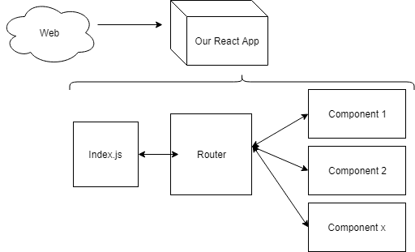

# Digital writing

Welcome!

---

Plan for the day:

- interfaces for reading and writing
- react recap, then props and routing

---

## Reading interfaces

---

The three readings articulate around the changes of how information, and text in particular, is represented through software.

---

### Computational Poetics

Dennis Tennen, _Computational Poetics_.

Where is the word stored? and how?

<!--

The author starts the reading by reflecting on how strange it is to "open a book by swiping on a piece of glowing glass". We've had books in their current form for almost 1000 years, so what exactly are these changes that we see happening to the written word?

-->

---

3000 B.C. writing appears, we write to remember what we said


The medium evolves:

- clay tablets
- stone carving
- linen
- scrolls
- codex (books)

<!--

Books appear only around 100 A.D. in their modern form (pages, hardcovers, glued spine), but writing is much older. Since the beginning, it was used to store information. First commercial information, as on the clay tablet above, but also legal and religious edicts (which were often the same thing).

Moving from clay to paper books is already a kind of broadening of access. Books become more and more common, and are used more often to represent any kind of knowledge.

-->

---

Books are seen as the main means to communicate knowledge.


<!--

The Encyclopedia is the first large-scale endeavour to formalize non-verbal knowledge, such as dyeing fabric, pictured here.

This endeavour was a use of words and symbols in combination in order to link connecting concepts, machines, culture and practice.

-->

---

1950 A.D. writing disappears.


<!--

With the invention of the computer, it becomes possible to separate the __storing__ of a symbol and the __representation__ of a symbol. For thousands of years, how a symbol was stored was also how it was displayed (i.e. visibly inscribed on a surface).

But now, no longer. The CPU stores words in binary voltage, and shows it to us in whichever way we decide (letters, emojis, sounds).

-->

---

The last people who _really_ wrote are the ones who write software.[^kittler]

<!-- Kittler's famous punchline summarizes this relationship: if writing is making marks, we are no longer doing so, only engineers are really doing it. -->

[^kittler]: Kittler, F. A. (1997). There Is No Software. In _Literature, Media, Information Systems: Essays_ (Ed: John Johnston). Amsterdam Overseas Publishers Association.

---

Text is no longer what it used to be, it's hidden, it's distant, it's changing.

<!-- So here we are today: text has changed, it's unrecognizable. So we need to make it recognizable again by using interfaces. -->

---

### Reading Interfaces

Johanna Drucker, _Reading Interfaces_.

Why, and how should we pay attention to our interfaces?

---

Communication has always been _mediated_:

- body language (pre-alphabet, expression of emotions, shared with animals)
- speech (tone, emotions, sincerity, irony) (answer) (synchronous)
- writing (alphabetical) (asynchronous) (rhetoric) (prayers and legal texts)
- writing (numbers) (quantity and money, how much a thing is worth) (abstracting things) (numbers can be in a rigorous sequence, and a rigorous system)
- code (numbers and letters)

---

An interface is a kind of medium which is __explicitly designed__.

How interfaces make us think?

<!--

An interface is a kind of medium, but is explicitly designed. Someone, somewhere, has chosen to represent these binary numbers in a particular way, in order to elicit a particular kind of way of thinking, of directing our attention on some things rather than others.

By guiding our attention, they do make us thinkg.

-->

---

The first computer interfaces were:

1. __punched cards__
2. __switches__ and __lights__
3. __pixels__ (text)
4. __pixels__ (images)

<!-- This is a history of having interfaces that are both more and more complex, but at the same time more and more easy to make -->

---

A writing interface that frames how we write.


<!-- For instance, we can think of the "What you see is what you get" interface. Which is a problem we never had before: what we saw was always what we got. -->

---

A reading interface that frames how we read.


<!-- In terms of reading, we can include more in a document than only text: for instance, we can include code which locks up the document 48 hours after having read it. Again, very unique property of text-as-code since, before you could only get a text taken from you if someone went to physically take it. -->

---

A mental model is never the same as physical reality, but tries to map on to it.

How complex should the mental model be?

__iMovie__ vs. __AfterEffects__

<!-- 

So the interface is what it allows you to think, and what it allows you to do. For instance, an editing software can be dealing with the same thing (putting images together to make a narrative illusion of movement), but they present themselves in very different ways: iMovie is casual, while AfterEffects is expert. 

Such framing involves which _entities_ are being displayed, how they are related, and they can be used.

-->

---

Each form of communication has different pros and cons.

__speech__ involves the present, the immediate. it has the most emotion and is directly social.

__writing__ involves the past, lasting throughout the ages and is less personal, asynchronous.

__coding__ involves the modularity, connectivity and replicability.

<!--

Specifically, each of them has an aspect of __co-creation__

- speech can involve live discussion, and the collaborative development of ideas in the short term.
- writing allows for asynchronous quoting, slowly building on the ideas of others

Coding as a medium for expression has particular aspects about modification and connection:

- nonlinear: it allows the reader to traverse the layers of text, offering (or not!) directions.
- modular: it can structure information together at different levels of abstraction
- replicable: it can be easily copied, modified and distributed

-->

---

### Electric Zine

Nicholas Froio, _Electric Zine Maker as a creative DIY Open-Source tool_.

The transformation of the medium involves transformations of practices.

---

What is open-source?

---

Lowering barriers to entry involve:

- (almost) no-cost sharing
- accessibility
- community

<!--

open-source is the drastic lowering of the barrier to entry

it also has particular values such as:

- sharing
- accessibility
- solidarity (good open-source implies a good open-source community)

-->

---

The zine a.k.a. punk publishing!

<!--

came out of the punk and feminist scenes, to bypass circuits of authority

quick and easy

full of emotions

redefining important topics

redefining what 'good' means

-->

---

- [special.fish](https://special.fish)
- [trashheap.party](https://trashheap.party/issues/)
- [artistic library of print on demand](https://apod.li)
- [zine-machine](https://glitch.com/~zine-machine)

---

The transformation of a medium can involve new dependencies and new possibilities.

<!--

some of these dependencies are:

- ephemerality
- levels of legibility/levels of obfuscation
- access over ownership

some of those possibilities:

- access and distribution
- modularity and remixing

-->

---

## React

---

- Recap (what is react, what are the files?)
- Components (how to separate documents in re-usable parts)
- Routing (how to direct the user to different components)

---

### Recap

---

React is a __framework__ to make __interactive__ webpages.

---

We write __components__: JS files that generate (return) HTML components.

---

Components can be combined by __importing__ and __exporting__.

---

Anatomy of a component:

```js
// importing some stuff at the beginning

export default MyComponent(/* possibly some stuff here */) {
    // possibly some stuff here
    return (
        <div>
        // always some HTML here
        // sometimes mixed with JS
        </div>
    )
}
```

---

__weird note__: the `return` can only have __one__ HTML element at the top.

```html
&lt;div&gt;&lt;p&gt;&lt;/p&gt;&lt;/div&gt;
```

and not

```html
&lt;div&gt;
&lt;/div&gt;
&lt;p&gt;
&lt;/p&gt;
```

---

### Routing

---

Routing is the process of deciding what to show based on a URL.

```txt
https://mydomain.com/path?query=value
```

What interests us here is the __path__.

---



---

First, we setup a __router__ component with all the possible available pages.

Second, we import all the __components__ we want to display and add them to the routes.

Third, we put this router on the main files `app.jsx` (every visit will go through this router).

---

### Props

---

Do I need to make a whole new component for every piece of information I want? No!

We can __separate form from content__.

---

Form > components

Content > __props__

---

We can pass different props (content) to the same component, to have different results!

---

```jsx
export default TheReadingResponse({title, text}) {
    return (
        <div>
            <h1>{title}</h1>
            <p>{text}</p>
        </div>
    )
}
```

```jsx
import {TheReadingResponse} from "./TheReadingResponse.jsx"
export default ReadingResponses() {
    return(
        <div>
            <TheReadingResponse title={"Week 2 - Augmenting"} summary={"I thought this was interesting, but a bit utopian"}/>
            <TheReadingResponse title={"Week 3 - Culture"} summary={"Museums do not have a monopoly on culture"} />
        </div>
    )
}
```

---

Demo:

Display a summary card for each of the reading responses.

---

Exercise:

Add a new page to your website on which you will show multiple components that make use of props.

For instance, it could be an image gallery, a notebook with some thoughts, a list of the places you've visited in Berlin, etc.

---

Detailed steps:

1. Add a new file in the `pages` folder
2. Modify the router to include a route to this new page
3. Add a new component in the `components` folder. Make sure the arguments of the function can include props
4. Import the new component inside your new page
5. Pass some props to the page.
6. Style it nicely!

---

## Outro

---

The digitalization of writing is a significant change in the (long!) history of writing. It comes with pros (access, modification) and cons (ephemerality, loss of agency due to interfaces).

---

Homework:

- Book learner hours.
- Post your reading response on your React website, using a new route.
- Read [Getting Started With React](https://react.dev/learn).
