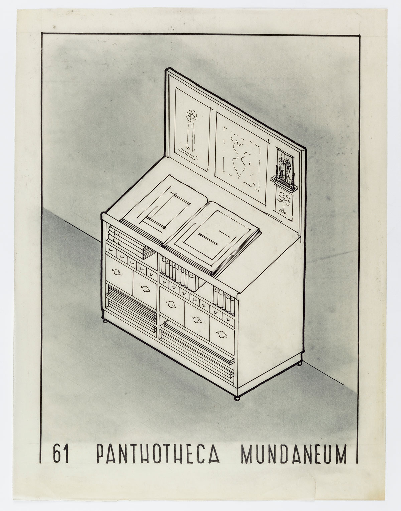

# Hypertext

Welcome!

---

## Intro

Plan for the day:

- reading presentations Hong
- hypertext and networked writing
- exercise with hyperlinks
- react states

---

Readings presentation by Hong

---

## Hyperlinks

---

The prefix __hyper__ comes from _beyond_ rather than _extra_.

<!--

It is meant to suggest that the reach of meaning can go _beyond_ the immediate document (page, book, paragraph).

-->

---

The web did not create the hyperlink, but popularized it.

The web is made up of __hyper__-text, and __hyper__-links based on __hyper__-references.

<!--

Everytime you see the letter H in one of those acronyms, it probably means hyper!

-->

---

But the dream of connecting knowldege has been long in the making




<!--  The first attempt at systematizing knowledge through connections was the Mundaneum, a building in Belgium where all information was interconnected through a set of index cards. Think of it as an encyclopedia, but with footnotes and references spread at the end of each entry. -->

---

The first digital version of hyper-text is __Project Xanadu__.

.

<!--
The original terminology comes from Ted Nelson's [Project Xanadu](https://en.wikipedia.org/wiki/Project_Xanadu), a design for deep document sharing. Even though the vision was never realized, as a vision it still influenced other projects that came after it, most importantly the design of the World Wide Web.

You can watch a video about it [here](https://www.youtube.com/watch?v=En_2T7KH6RA). It is taken from Werner Herzog's excellent documentary [Lo and Behold: Reveries of a Connected World](https://en.wikipedia.org/wiki/Lo_and_Behold%2C_Reveries_of_the_Connected_World).

-->

---

So we move from __single__ texts to __networks__ of texts,

from __intratextuality__ to __intertextuality__.

[diagram.website](https://diagram.website)

<!--

The focus was on __intertextuality__: the dialogue between things helps to make new sense. Rather than a very focused approach on what a document means, we shift our attention to the broader themes of which the document is part of, as shown in the diagram.website.

This also implies a move from linear reading to something closer to wandering.

-->

---

### Hyperdocument

---

Connected art documents: [ArtLinks](https://artlinks.metmuseum.org)

<!--

Things do not exist in a void: there are always ways of connecting them with another thing which is both:

- similar in a way (this helps us to make sense of the connection) 
- different in a way (this helps us have a more detailed understanding of each of the connected thing)

-->

---

A hyperdocument requires some _categories_:

- themes
- actors
- events
- places
- etc.

This is at the root of the __Semantic Web__

```html
&lt;div vocab="https://schema.org/" typeof="Person"&gt;
  &lt;span property="name"&gt;Paul Schuster&lt;/span&gt; was born in
  &lt;span property="birthPlace" typeof="Place" href="https://www.wikidata.org/entity/Q1731"&gt;
    &lt;span property="name"&gt;Dresden&lt;/span&gt;.
  &lt;/span&gt;
&lt;/div&gt;
```

<!--

The Semantic Web is a dream of being able to give proper meaning to all of this machine text that exists in HTML documents. The idea is that, since all of it is already made readable for computers, we could use this existing system to give it another layer of meaning, and we could thus create a very elaborate a rich network of references and relations.

It's a bit as if the whole Web would be like Wikipedia: words throughout each text could be connected to other words, because the computer would know that it's not just, say, a <h1> but that it's a <h1 typeof="FilmTitle"> and could automatically establish connections to other film titles!

-->

---

Categories are then connected by _relations_:

- cause
- consequence
- exclusivity
- simultaneity
- similarity
- difference
- ...

<!-- But it's not just about describing entities in more details. The connections between entities are also important. -->

---

With these relations and entities, an external structure can happen, through the __gestalt__ effect.

<!--

gestalt psychology analyzes the phenomenon according to which _the whole is more than the sum of its parts_.

We can also think of it as a collage: the individual pictures make a certain sense, but working together they can sometimes tell a whole other story.

-->


---

### Hyperbrowsing

what are pros and cons of multidirectional readings vs. linear reading?

<!--

Linear reading makes it easier for the author to make a point.

Non-linear reading gives more agency to the reader to figure out things on their own, but it comes at the expense of focus (or maybe we're just not used to it?)

-->

---

The process of _dérive_ involves unexpected associations.

<!-- 

Dérive is a term invented by the [Situationist International](https://en.wikipedia.org/wiki/Situationist_International), and was aimed at countering strict ways of existing and thinking (structure and discipline were still all the rage in the early 1960s). 

Their example was to get lost in the city, to embrace unexpected associations and discover just by wandering around, in unexpected ways. We could see browsing the web as a kind of derive, without always necessarily needing to find ulterior, structured knowledge.

-->

---

## Machine connections

---

API are how machines and humans can communicate between each other in a more systematic way.

<!--

Hyperlinks are not the only ways to carry around information on the Web.

An _application programming interface_ is how you give access to an underlying system. For instance, the SoundCloud website is composed of an API, which is then used by the designers to organize the information visually. With those two links, you can see that the actual data is the same in the API and the webpage versions.

-->

humans: [soundcloud.com](https://soundcloud.com/pierrepierre/sets/weird)

machines: [api-v2.soundcloud.com](https://api-v2.soundcloud.com/playlists/1409997140?representation=full&client_id=aV5l7m3Cav0rfhx8PM4VVUUKJ63ZIlUs&app_version=1698662608&app_locale=en)

---

APIs allow for a more systematic organization (organize first, then navigate)

<!--

Hypertexts lets the human navigate data, and figure out its own organization.

APIs asks the machine to organize data first, then present it.

-->

---

[europeana](https://www.europeana.eu/en/galleries/9104-migration-in-artworks) is an API-based online museum.

<!--

It gets content from different sources, as each individual museums provide access to an API. Europeana just gathers them in the same place. It recombines data flows from around the Web to present a particular collection, which is a particular kind of intertextuality, artworks being in dialogue with one another.

-->

---

Two ways to lind data, but __different__ directions:

<- -> __centrifugal__: hyperlinks navigate away from the page

-> <- __centripetal__: APIs bring data into the page

---

## Connection exercise

---

- create a new page on your react application
- find a short text about something you liked (e.g.  description of an artwork, the story of a place, some excerpt of a reading)
- insert at least __20__ links to other websites inside that description.

it's up to you the kind of _relations_ you choose and the kind of _structure_ you suggest.

---

## React

- Recap from last week
- Loading data
- Making it interactive

---

### Recap

---

What are routes?

What are props?

---

Routes are ways in which we decide which components get displayed based on the URL __path__.

Props are pieces of data that we give to a component.

```jsx
export default SingleReview({title, text}) {
    return (
        &lt;div&gt;
            &lt;h1&gt;{title}&lt;/h1&gt;
            &lt;p&gt;{text}&lt;/p&gt;
        &lt;/div&gt;
    )
}
```

```jsx
import {SingleReview} from "./SingleReview.jsx"

export default AllReviews() {
    return(
        &lt;div&gt;
            &lt;SingleReview title={"Augmenting"} summary={"I thought this was interesting, but a bit utopian"}/&gt;
            &lt;SingleReview title={"Culture"} summary={"Museums do not have a monopoly on culture"} /&gt;
        &lt;/div&gt;
    )
}
```

---

### Loading data

---

Content can be further separated from form.

1. We structure data into a JSON object
2. We import it into a JSX file
3. We display it as we want

---

__JSON__ is a way to structure data in `key: value` pairs

```json
{
    "key": "value"
}
```

```json
{
    "all_stories": [
        {
            "title": "once upon a time",
            "summary": "this is a story that starts very traditionally"
        },
        {
            "title": "antigone",
            "summary": "choose between what you think is moral and what is legal"
        }
    ]
}
```

---

Import it:

```js
import stories from "./stories.json"
```

Do something with each story:

```js
stories.map(function(story) {
    return(<div>{story.title}</div>)
})
```

---

Exercise

- Write a JSON file with four or five entries about __berlin culture__
- Think about which categories (keys) are revelant.
- Create a new page in your React website, import the file and display it.

---

## Outro

---

Hyperlinks is perhaps the most unique aspect of the Web, and helps us reconsider how knowledge can be structured

---

__Homework__:

- Write your reading response on a page by importing it as a JSON object. Add at least 5 hyperlinks in the response to connect your thoughts to other topics.

__Next week__ we will discuss details about the final project.
