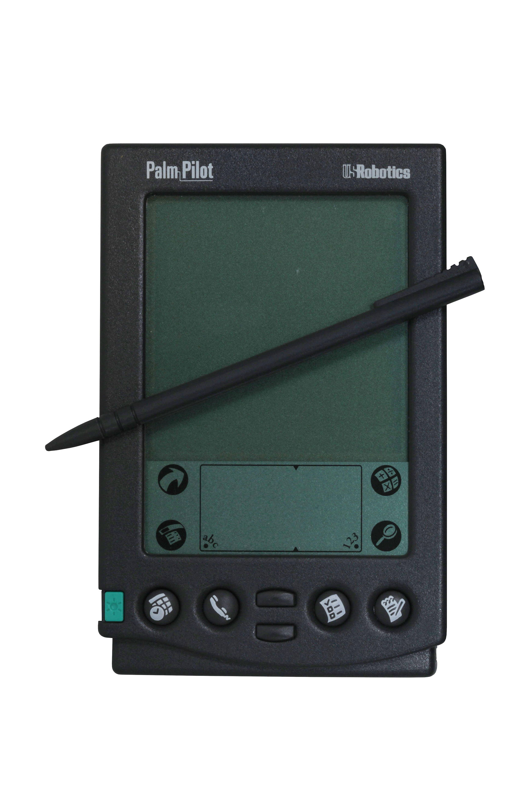

# Mobile Computing

Welcome!

<!-- This session, we discuss the developments and implications of portable media, both from a technical and from a cognitive perspective. How did computers manage to shrink to our pockets? What was the hope in terms of learning and development? -->

---

Plan for the day

- Personal dynamic media
- Mobile computing
- Augmented spaces
- Final project
- React interactivity

---

- _Personal Dynamic Media_, by Alan Kay and Adele Goldberg, 1977.

What are they describing?

---

## Personal dynamic media

---

when are phones a "dynamic medium for creative thought"? when are they not?

---


<!-- it was made at xerox park -->

---

Understanding something means having an accurate __mental model__.

Mental models are __coherent systems of parts and relations__.

<!-- mental models are a dynamic, structured representation formed in memory as a result of using personal knowledge and environment cues, which help interpret, explain, and act on a target system -->

---

A dynamic medium is about the simulation of activities and concepts, to support the creation a mental model.

There is a difference between the domain represented (__what__), and the representation (__how__).

<!-- 

*external* world

*interpreted* world

*expected* world

The external world is the world that exists, the world that we start from.

The interpreted world is how we make sense of that world through pre-existing cultural knowledge, or through contextual cues.

The expected world is the world that we would like to manifest through our actions (or lack thereof). It is the result of our intention as enabled by affordances; how we change the world.

tools can have an influence on translating the external into the interpreted

 -->

---

## Epistemic interactions

---

some interactions developed in smalltalk can be called __epistemic actions__:

- mark
- peek
- save
- compare
- orient
- change
- ...

---

### Mark

---

Changing appearance to note an important part.

[hypothesis](https://web.hypothes.is/)

[medium](https://help.medium.com/hc/en-us/articles/214406358-About-highlights)

[highlight essays](https://jon-e.net/infrastructure/#introduction)

---

### Peek

---

Revealing only part of related content

[wikipedia](https://en.wikipedia.org/wiki/Peek)

[gwern](https://gwern.net/gpt-3)

---

### Save

Export to a separate document

[zotero](https://www.zotero.org/)

[pinterest](http://pinterest.com/)

---

### Compare

Split the document in related sub-documents

[driftbacks](https://aegean.forensic-architecture.org/)

[digital violence](https://www.digitalviolence.org/#/platform)

---

### Orient

Locate the visitor in a larger document

[growing regions](http://npl.wiki/view/welcome-visitors/view/growing-regions)

[aesthetics of source code](https://sourcecode.enframed.net/understanding/means-understanding/)

---

### Vary

Change a value within a given range

[tangled](http://worrydream.com/Tangle/)

[bicycle](https://ciechanow.ski/bicycle/)

[a* pathfinding](https://www.redblobgames.com/pathfinding/a-star/introduction.html)

---

## Mobile computing

---

First step was __minimizing__, with the shrinking of transistors, batteries and antennas (2G, 3G, 4G, etc.).



---

Second step was __intefacing__, with the development of hardware and software interfaces (natural gestures for navigation).


---

Third step was __converging__, by merging a lot of different features on the same device, and transforming hardware into software.


---

### Computing in space

---

How does having a connected phone change how we relate to our surroundings?

---

- __upload__: they send out information from a given location, from which action can be deduced
- __download__: they get information about a given location, from which action can be taken

[moveable type - ben rubin and mark hansen](https://www.nytimes.com/video/arts/1194817116105/moveable-type.html)

<!-- 

a _data space_ is a set of correlated data points, constituting a coherent whole.

-> insert data into everyday life

-> extract data from everyday life

The flows of data go in two directions:
- extraction (surveillance)
- insertion (augmentation

Two different ways of doing augmentation: creating new data (sound walks) or highlighting existing data (jewish museum).

-->

---

Base requirements are there (speed, resolution, portability, connectivity). The next steps are __context__ and __content__.

context-awareness can be __personal__, __chronological__ or __geographical__.

a.k.a where/when/who is the user, and what do they want to do?

<!--

human memory is __constructive__ memory: memories are created as they are accessed. computer memory is __static__ memory: memories are exactly the same as they were first written.

[yesterscape](http://yesterscape.com/)

Constructive memory means that we actively create memories as we recall them. While a computer, for now, is only accessing memory in a location, humans combine them to create new ones. Which means that our memories, obivously, aren't "objective", they are tailored not only to our experiences, but to how we recall these experiences. The consequence of that is that, if computers start to have constructive memories, they would start to be **personalized**.

constructive memories means taking into account the individual, and its current needs. Just as we are constituted as a series of events, is it possible to apprehend computers as learning as well? To some extent, this is what AI is doing: developing recommendation algorithms happens through the recurring process of learning, presenting, learning again.

-->

---


---

subsuming physical reality with digital realities prioritizes the individual over the collective.

---

## Final Project

---

A website documenting a culture or a knowledge (or the intertwining of both)!

- [The culture of Tijuana](https://tijuana-game.glitch.me)
- [The culture of Berghain](https://new-berghain.glitch.me)
- [Chat technologies](https://www.chattech.harrydnewman.com)
- [Technoculture](https://drive.google.com/drive/folders/1DAotH5hYpBONoxoY-sNr0qiMOlsdRGIN)
- [Debussy Music](https://final-project-dear-debussy.glitch.me)
- [Album coverz](https://drive.google.com/file/d/15ph4Gnp114OZK9BLgDI073OAeFx4u7Ej/view)
- [Astrology Comparison](https://drive.google.com/drive/u/1/folders/1jrsUBcI_eC7sKnBITj3XGlpT-6cOc3BA)
- [Immersion in Zelda](https://drive.google.com/drive/u/1/folders/16we_QSMNGQy3hSMbWkXZ_cs0rVNmgAsR)

---

Timeline:

- next week, present ideas
- in two weeks, present organization and first-pass on design
- after spring break, development

---

## React

---

Recap:

- What is JSON?
- What is a loop?

---

```json
{
    "all_stories": [
        {
            "title": "once upon a time",
            "summary": "this is a story that starts very traditionally"
        },
        {
            "title": "antigone",
            "summary": "choose between what you think is moral and what is legal"
        }
    ]
}
```

```js
stories.map(function(story) {
    return(<div>{story.title}</div>)
})
```

---

__Interactivity__!

In HTML, we need to update variables, and then update the actual document

(e.g. `isVisible = true` and `document.getElementById("...").style.display = "none"`).

In React, we just need to update the variable! But for this, we need `useState`.

```js
const [isVisible, setIsVisible] = useState(false)
```

---

Demo:

How to __filter__ film reviews by year.

---

Exercise:

Make a button that toggles the visibility of film reviews by whether or not they have a trailer link.

---

Homework:

- Add an interactivity component to your reading response by leveraging `useState`
- Add a new page where you describe two ideas for a final project.
