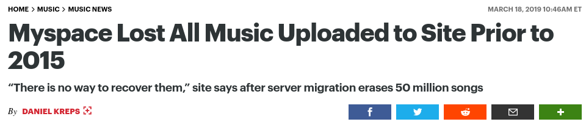

# Born-digital artefacts

Welcome

---

## Introduction

---

Plan for the day:

- reading presentations
- digital artefacts
- maps in React
- working session

---

- _The internet will not remember you: curation of autobiographical online materials in Russia in Spring 2022_. Anya Shchetvina, 2024.
- _Digital Social Memory and the Case of the Online Archive of Internet Art_, Lozana Rossenova, New Criticals, 2017.
- _The Challenges of Preserving Digital Art_, V. Cerf, Google Arts & Culture, 2019.

---

## Born-digital artefacts

---

who is responsible for an instagram account?

---

how would a museum exhibit [an instagram account](https://webenact.rhizome.org/excellences-and-perfections/)?

<!--

running the software on software/hardware (mobile vs. desktop)

showing it throughout the years, showing it in context

- personal account
- influencer account
- news account
- institutional accounts

-->

---

> "The basic characteristics of digital work are that it is **programmable**, **iterative**, **generative**, and frequently **networked**." -Johanna Drucker

<!--
There are different ways of naming art made with computers: new media art, digital art, time-based media, variable media.

The definition we will use here is that of computational art, an art that is essentially *interactive* (i.e. needs to be completed by an audience), art that relies on particular *processes* of the medium/machine rather than just the finished product. As such, it is an art that is always in becoming, that always realizes itself. It can have different version, both at its core and at its manifestations.

The question that arises, then is that, if there is no "canonical state", what state should it be presented in? What is its natural state?
-->

---

The challenge is to balance between intent, hardware and presentation.

<!-- 

So while we're still trying to understand the historical significance of these digital objects, there is still a need to develop an approach right now to best serve the interests of the future.

A first approach is obviously the choice of hardware and software: do we decide to show it as a re-interpreted piece (running on the latest hardware, with different processing speeds, graphics, sounds) or do we leave it as the original, on the original operating system, with the original browser? Do we offer a time capsule, that is self-contained in the past or something that integrates seamlessly into the present? Let us not forget that [computers are theaters](https://ptgmedia.pearsoncmg.com/images/9780321918628/samplepages/0321918622.pdf), and their installation already creates personas in the users.

A second approach is actually to take a step back, and focus on the qualification (i.e. the improvement) of the context by using older media, publishing manifestos, wall text, and explanations that highlight the complexity of the art. This provides an insight in how communication works: it is not about always using the latest technology, but rather about using *different* media, providing a different angle on the same piece.

 -->

---

To do that, we need to have a lot of different documentation media

- source code
- hardware
- peripheral community media
- peripheral artist media

<!-- Digital art is often based on conceptual art, following [Sol Lewitt](http://www.altx.com/vizarts/conceptual.html), which means that the idea, or the intent behind the art is as important as the form itself. So there should be some sort of freedom with regards to the technical implementation. David Rokeby wanted *Very Nervous System* to be a piece about paying attention to the body rather than the system. The changing technical contexts means that it might not be the case anymore.

However, the hardware does pose some important limitations. First of all, it fails, so it might need to be replaced, and with different hardware. Does that still maintain the "preservation" mission of the museum? Where is the limit to manipulation? Example of Sophia Al Maria's Litany: the piece was bought by the Whitney with used devices, then exhibited in Dubai with brand new devices. It was then shown in Chicago, but in what form? They can ask the artist, but what if the artist isn't there anymore?

Is there a need to respect the artist's original intent? And how do you make that decision? Currently, this is solved by having lots and lots of documentation and  archive material. -->

---

Digital media also tends to be interactive: the public should be able to engage with it.

<!--

More than any other works of art, these are pieces that are made to be engaged with by the audience. As we've seen with the procedural rhetoric approach, the piece itself should already be explaining what is the case. For instance, who understands Tetris better? Someone who's played it everyday for 15 years, or a curator who never owned a Game Boy? Does it need to be displayed on the [Electronika 60](https://en.wikipedia.org/wiki/Electronika_60)?

Another example is [Access](https://vimeo.com/47601580) a site-specific installation which must be lived in order to be understood.

So now there are two different problems: you need to have the audience engage with the work, and you might still want to contextualize what that work is. Because even though it's recent, doesn't mean all the artistic and cultural implications of it are understood.

-->

---

The [net art anthology](https://anthology.rhizome.org/) team currently leads efforts to preserve digital-born artworks.

---

Digital heritage are _cultural_ objects, both ubiquitous and ephemeral.

<!-- 

Humans create more and more information every year, and all that information is relevant to the times today (and is going to be incredibly useful to future generations of historians). The question then is how do you preserve all of that? Do you rely on private companies like MySpace or Twitter?

So beyond the preservation of digital, there is a separate need for preservation of digital cultural heritage, including platforms such as Vine, MySpace, LiveJournal, or Myst Online. An example of this kind of digital heritage are [MUDs](https://en.wikipedia.org/wiki/MUD), where a lot of early programmers engaged in early networked interactivity, 4chan.org, where a lot of early neo-fascist movements have developed and organized.

-->

---

__evocative objects__ are the representation of thoughts, feelings, memories within things.

__autotopographies__ are the curated networks of such objects.

<!-- They are also different whether it's active (publicly displayed, available) or passive (kept hidden) -->

---

- should digital artworks remain in their original environment?

- should physical museums (geographically-bound, responsible for preservation) be responsible for cyberspace content (non-geographically-bound, responsible for interaction)?

<!--

Should you have to play the Sims on an original PC? Should you have to access wikipedia on a dial-up connection?

Who is responsible for Soundcloud? For YouTube? Should individual users be responsible for their own content? Or, on the opposite, should we just learn to let go of the past and not archive anything?

In the case of pieces that were built on certain expectations, and knowledge levels of the public at the time to elicit a certain feeling/expression, should the artwork be updated to match a changing audience, or should it remain the same state, and mediate to the audience why a certain artwork was essential at the time?

-->

---

## React Maps

---

Using two libraries: [leaflet](https://leafletjs.com) and [React-leaflet](https://react-leaflet.js.org)

---

## Work session

---

Kanban boards: breaking things down into __to do__, __doing__, __done__.

Retro-planning: managing time, starting from the deadline, and working backwards until the current day.

[MoSCoW](https://en.wikipedia.org/wiki/MoSCoW_method#Prioritization_of_requirements): prioritizing

---

Identify the most important parts of your project:

- data collection
- modes of presentation (which components, how are they organized)
- special interactivity

---

## Conclusion

---

Homework for next week:

- Make progress on your final project. Come ready to discuss it in class.
- Add a map component with some markers on some meaningful places in Berlin
- Write your reading response on your Glitch website.
