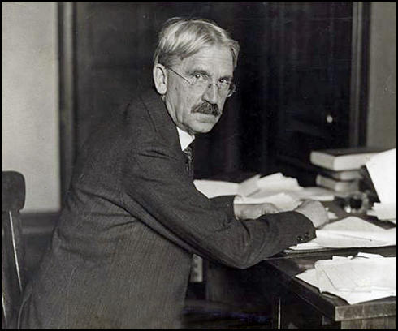

# Learning styles

Welcome!

---

## Introduction

---

Plan for the day:

- Born-digital artefacts
- Learning styles
- Work session

---

## Readings

seymour papert and idit harel, __situating constructionism__

working with [jean piaget](https://en.wikipedia.org/wiki/Jean_Piaget)

made the [logo programming language](https://en.wikipedia.org/wiki/Logo_(programming_language))

---

what was your impression of the reading?

what is constructionism? constructivism? instructionism?

<!--

- instructionism (abstract knowledge, sin = cos/tan )
- constructivism: knowledge is a structure (gestalt, "the whole is greater than the sum of its parts")
- constructionism hands-on, experimental

- learning-by-making (arts)
- learning-by-listening, speaking (debate) (facts, computers start counting at 0, history dates, math formulas)

-->

---

how are computers used to learn (at the time of writing and today)?

<!--

- depends on the styles of learning / generational gap
- trying all the things one can on a computer / relationship to mistakes
- constructionist because we can create things with it
- personalized (why, how) -> keeping it in the short/long-term (bookmarks, favorites)

what's a feminist epistemology?

-> concrete knowledge, as opposed to abstract knowledge

- soapbox maths
- styles of learning
- constructing "active models"

-->

---

### Mediation and education

---

cultural institutions (galleries, museums) are supposed to educate

__what__ do we learn?

__how__ do we learn?

<!--

how do we learn: for instance, panels of information, ask questions (interaction), hands-on projects, learn from somebody else in the same tour with you (social context of a museum), anybody or expert, novice. digital spaces through comments/forums.

what do we learn? new facts (different perceptions) / new behaviour, reflect on our own position in society

-->

---

the modern museum is stretched between two __mediating__ roles:

- __aesthetic__
- __ethical/social__

<!--

_how can someone develop aesthetic/social knowledge just by looking/reading at something?_

Mediation means meeting someone in the middle, of having to concile (or re-concile!) two or more different parties. What is reconciled here is the truth held  by museums, as the cultural heritage which needs to be transmitted to the public in order to reinforce the sense of unity and communal belonging of this public. Additionally, mediation and education are rooted in the enlightenment spirit of learning and developing one's own knowledge so that, in the end, they transmit their worldview to the audience. This spirit of Enlightenment, a philosophical movement in Europe during the 18th century, aims to break free from immaturity, itself defined as "the inability to use one’s own understanding without the guidance of another." (Kant)

The questions here are those of understanding and seeing, objectivity and subjectivity, externalising and internalising: what are some ways of transmitting, and facilitating the development of ideas, concepts and knowledge.

But if mediation—and its counterpart, interpretation—imply closing the gap on the distance between a collection and the public, how come that gap is here in the first place?

(in needs to be in context/background knowledge (collections, texts)) -->

---

__hermeneutics__ is the act of interpreting _sacred_ texts, which also reinforces the sacredness of these texts.

<!--

Museums have, for a long time, never questioned how to proceed with education. It has always been top-down, explanatory, or even ommitted. Mediation has indeed been activated once the audience is in the museum, and not so much *before* such audiences would come to the museum: the assumption here is that everyone in the museum comes for the same reasons, wants to learn the same thing.

The approach is therefore self-contained and self-referential: it only exists within the world of the museum, since the museum represents the world, and it explains the artworks only in relationship to the artworks themselves. Art for art's sake is the manifestation of the luxury/privilege.

the sacredness implies some sort of hierarchy

"*museums exists so that people who go to museums can distinguish themselves from those who do not go*" - pierre bourdieu

People can distinguish themselves through the accumulation of _cultural capital_, the kind of benefit you get from having good taste, the knowledge of what _is_ good taste.

Bourdieu has a very strict sense of culture: it is culture as an economic product, a market in which value is produced, exchanged and kept in order to maintain relationships of power. He places the museum in this dynamic as a symbolic way to separate between those who know and those who don't know; it also makes the distinction between those who need to learn, and those who don't need to learn (because they come from distinctive social classes).

Taste is socially constructed, but it still possibly individually defined—by experiencing more things, being more exposed, learning/reading about it at the same time, paying attention and **motivations**.

High-art is not a necessity, it is rather the "pure" gaze, and is **self-referential**.

- access: money & location (downtown) & opening hours
- discourse
- form vs. function (maslow's hierarchy of needs): having the luxury not to care

The distinction also happens in the process of coding, and decoding, and "knowing what something means". Knowing implicit references is a social marker.

-->

---

didactic learning implies a reinforcing of implicit power dynamics and capital inequalities.

are there other forms of learning which address these issues?

<!--

The process of explaining to someone implies the situation in which someone knows (has power) and in which someone doesn't know (doesn't have power), and is therefore essentially unequal.

This type of education perpetuates distinctions between the elite and the masses, and as such has strong political undertones. If museums are going to follow on their process of access to all, they must also change the way they view education.

-->

---

take 5 minutes and think through:

what was a memorable learning experience in your life? what did you learn? how did you learn it?

---

<!--

Everything on the right hand-side of the diagram is broadly considered constructivism: constructivism is a broad philosophy, while discovery learning is rather a method, and implementation and as such has to deal with the reality of the necessity for common knowledge "milestones" still considered essential in traditional academia.

Milestones are usual in traditional learning: chapter by chapter, exercise by exercise, etc.

-->

---

__classical approach__: the teacher provides knowledge to the learner by feeding them truths/facts that already exist about the world.

It is formative, logical, efficient; risk of being boring and passive; works well for _foundational knowledge_.

<!-- The content isn't interactive, very well-organized and has clear learning outcomes. -->

---

__constructivism__ is based on the idea that any experience which allows for subsequent, novel experiences _is_ a learning experience.

<!--

Constructivism has a particular appeal to the museum, because it is suited to informal, voluntary, one-shot nature of most learning which happens in a museum.

First developed by John Dewey, political philosopher and educator, constructivism challenges the *passive learner* approach and offers activities to the learner so that they can construct knowledge by themselves. 

Discovery learning, an offshoot, still involves teacher supervision, assessment/feedback and example solutions, and also requires **pre-exisiting knowledge**. In order to build from pre-existing knowledge, it therefore becomes important to know the background of your visitors/students/participants.

-->

---

> A teacher tells, a facilitator asks; a teacher lectures from the front, a facilitator supports from the back; a teacher gives answers according to a set curriculum, a facilitator provides guidelines and creates the environment for the learner to arrive at his or her own conclusions; a teacher mostly gives a monologue, a facilitator is in continuous dialogue with the learners.

---

> "Because something has been learned by someone, and because we are all born equal, then that thing can be learned by anyone." - jacques rancière, [the ignorant schoolmaster](https://en.wikipedia.org/wiki/The_Ignorant_Schoolmaster)

<!-- "what do i see? what do i think of it? what do i make of it?" -->

---

the most important question in education is:

__why__ should one learn this?

once this question is answered, the following is:

__how__ should one learn this?

<!--

All of the above are part of a broader field named *critical pedagogies*, including educators such as [paulo freire](https://en.wikipedia.org/wiki/Pedagogy_of_the_Oppressed), who brings in ideas about **narration and storytelling** as essential to learning and [bell hooks](https://archive.org/details/teachingtotransg0000hook), who argues that a central element of teaching is the ability for the teacher to encourage and motivate individuals into a learning situation through **performance** (i.e. not just reading notes from a pedestal in an amphitheater).

The 'why' question depends more and more on the background of the visitor, such as personal trajectories, and where they come from

-->

---

What kinds of materials, what kinds of presentation allow for multiple learning styles?

tbd. next week

---

## Work session

---

Take a look at your breakdown of tasks, and your schedule, and identify the most important parts.

---

## Conclusion

---

Homework:

- tbd
